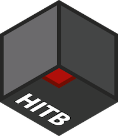
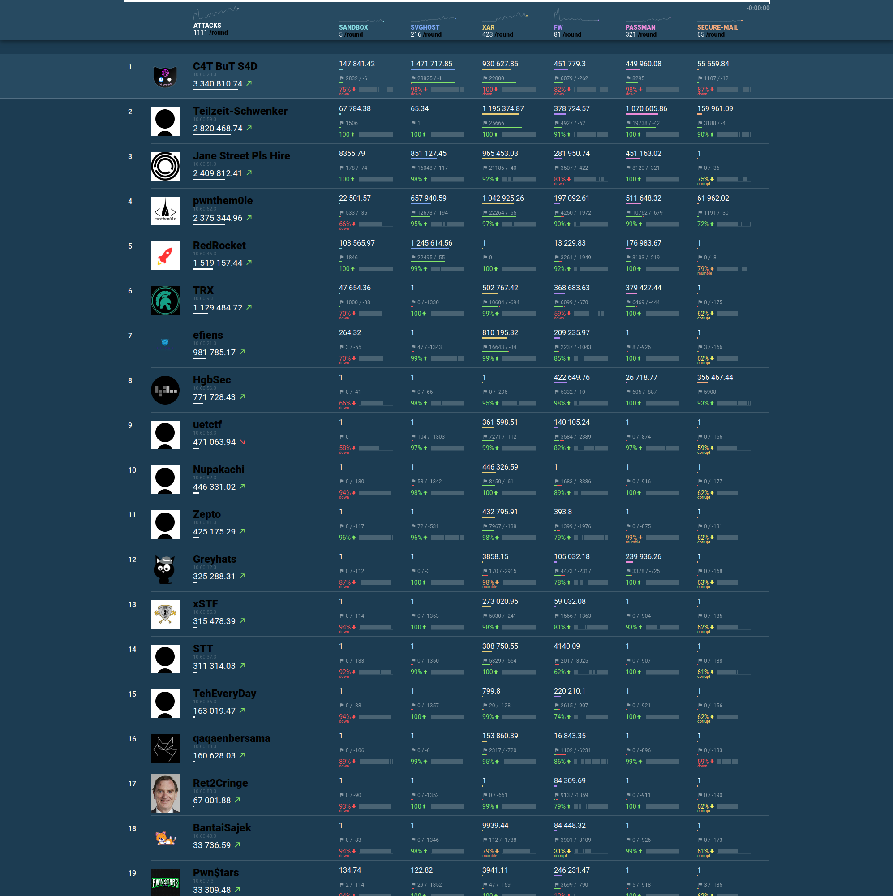

#  HITB SECCCONF EDU CTF 2021

SECCONF EDU CTF is an online international challenge in information security. Developed by Hackerdom team for HITB SECCONF in Singapore. SECCONF EDU CTF was held on August 27, 2021.

The contest is driven by almost classic rules for Attack-Defense [CTF](https://en.wikipedia.org/wiki/Capture_the_flag#Computer_security). Each team is given a set of vulnerable services.
Organizers regularly fill services with private information — the flags.
The goal of each team is to find vulnerabilities, fix them in their services and exploit them to get flags from other teams.

This repository contains:

* source of all services in folder [services/](https://github.com/HITB-CyberWeek/hitbsecconf-ctf-2021/tree/master/services/)
* checkers for [checksystem](https://github.com/Hackerdom/checksystem) in folder [checkers/](checkers/)
* exploits for all services in folder [sploits/](https://github.com/HITB-CyberWeek/hitbsecconf-ctf-2021/tree/master/sploits/)
* writeups with vulnerabilities and exploitation description for all services in folder [writeups/](https://github.com/HITB-CyberWeek/hitbsecconf-ctf-2021/tree/master/writeups/)

Also, we bring to you some of our internal infrastructure magic:
* checksystem and cloud console configuration in [ansible/](https://github.com/HITB-CyberWeek/hitbsecconf-ctf-2021/tree/master/ansible/)
* configuration for building the Digital Ocean vulnerable image in [vuln_image/](https://github.com/HITB-CyberWeek/hitbsecconf-ctf-2021/tree/master/vuln_image/)

Final scoreboard:

# First bloods

| **SERVICE**    | **TEAM**             |
| -------------- | -------------------- |
| fw             | TRX                  |
| xar            | Teilzeit-Schwenker   |
| passman        | Unreal Security      |
| svghost        | C4T BuT S4D          |
| sandbox        | pwnthem0le           |
| secure-mail    | HgbSec               |

# Authors

This CTF is brought to you by these amazing guys:

* Alexander Bersenev aka bay, author of service `passman`, also our network and infrastructure master
* Andrew Gein aka andgein, author of service `sandbox`
* Andrey Khozov aka and, author of service `xar`, also our checksystem master
* Artem Zinenko aka art, author of service `secure-mail`
* Dmitry Simonov aka dimmo, author of service `fw`
* Dmitry Titarenko aka dscheg, author of service `svghost`
* Konstantin Plotnikov aka kost, our teamleader

If you have any question about services write us an email to info@hackerdom.ru

© 2021 [HackerDom](http://hackerdom.ru)

